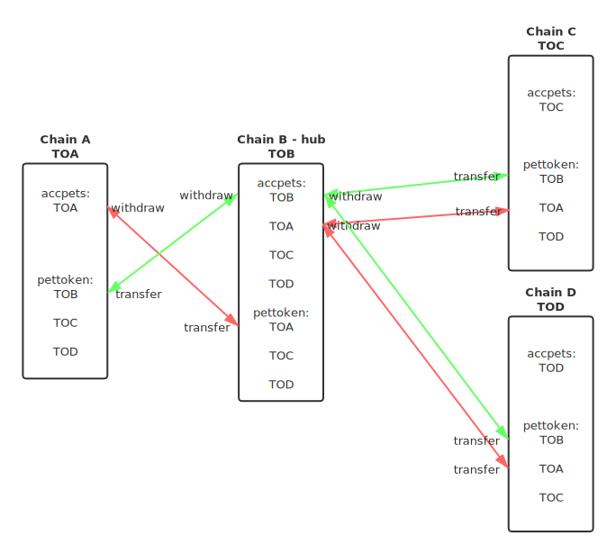

ibc_contracts
-------------

<p align="center">
  
</p>

starting from version 4, ibc_contracts supports the hub protocol, through this protocol, 
a star shaped inter-blockchain communication network can be formed, with one hub chain and multiple parallel chains. 
You can transfer a token on a parallel chain to another parallel chain with only one transfer, 
for more detailed information, please refer to [IBC_Hub_Protocol.md](./docs/IBC_Hub_Protocol.md)


### Build
The two contracts are developed entirely on eosio.cdt, so you can compile them with eosio.cdt. 
Also, you can compile them with bos.cdt, for bos.cdt only adds some contract interfaces, 
the existing interfaces of eosio.cdt have not been changed. 
However, eosio.cdt and bos.cdt use different version number, so you should use following commands to compile:  

```
$ ./build.sh eosio.cdt  # compile with eosio.cdt
$ ./build.sh bos.cdt    # compile with bos.cdt
```

If the target chain of the deployment contract is a hub chain, you need to compile with the hub protocol.
```
$ ./build.sh eosio.cdt HUB_PROTOCOL=ON
$ ./build.sh bos.cdt HUB_PROTOCOL=ON
```

### IBC related softwares' version description

There are three IBC related softwares, [ibc_contracts](https://github.com/boscore/ibc_contracts),
[ibc_plugin_eos](https://github.com/boscore/ibc_plugin_eos) 
and [ibc_plugin_bos](https://github.com/boscore/ibc_plugin_bos), 
There are currently multiple major versions for all these three software repositories and between major versions maybe incompatible, 
so the three repositories need to use the correct major version number to coordinate their work.

compatible combination:  

| code           |  tag(s)       |
|----------------|---------------|
| ibc_contracts  | v3.x.x / v4.x.x|
| ibc_plugin_eos |  ibc-v3.x.x   |
| ibc_plugin_bos |  ibc-v3.x.x/ibc-v4.x.x   |

### IBC test localhost environment
[ibc_test_env](https://github.com/boscore/ibc_test_env) provides a great localhost IBC test cluster environment, 
you can find all the details related to IBC system deployment, contracts initialization, 
testing inter-blockchain token transfers in the bash scripts.

### Documents
 - [User_Guide](./docs/User_Guide.md) 
   Explains how blockchain users use IBC system for inter-blockchain token transfer by command lines.
 - [Token_Registration_and_Management](./docs/Token_Registration_and_Management.md) 
   Explains how to register a `token` in the IBC contracts to circulate on the two blockchains.
 - [Deployment_and_Test](./docs/Deployment_and_Test.md) Explains how to deploy and test the IBC system.
 - [IBC_Hub_Protocol](./docs/IBC_Hub_Protocol.md) Explains the hub protocol, and how to use it.
 - [Upgrade_v3_to_v4.md](./docs/Upgrade_v3_to_v4.md)
 - [Trouble_Shooting](docs/Troubles_Shooting.md) Explains how to troubleshooting when IBC system encounters problems.
 - [EOSIO_IBC_Priciple_and_Design](https://github.com/boscore/Documentation/blob/master/IBC/EOSIO_IBC_Priciple_and_Design.md)
 - [EOSIO_IBC_Priciple_and_Design 中文版](https://github.com/boscore/Documentation/blob/master/IBC/EOSIO_IBC_Priciple_and_Design_zh.md)
 